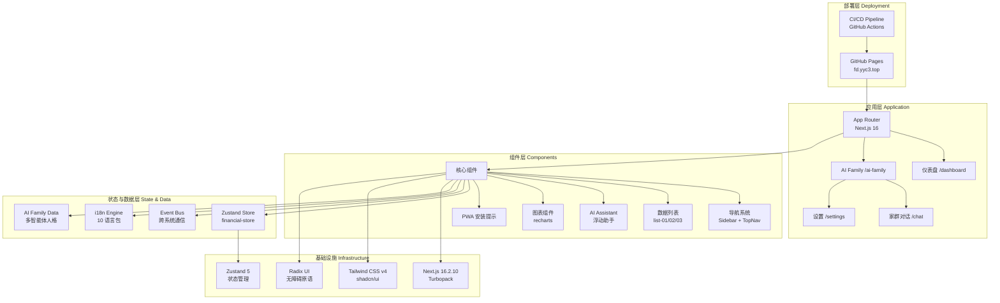

<div align="center">


# YYC³ Financial Dashboard

> ***YanYuCloudCube***
> *言启象限 | 语枢未来*
> ***Words Initiate Quadrants, Language Serves as Core for Future***
> *万象归元于云枢 | 深栈智启新纪元*
> ***All things converge in cloud pivot; Deep stacks ignite a new era of intelligence***

[](https://github.com/YYC-Cube/YYC3-Financial-Dashboard)
[](https://opensource.org/licenses/MIT)
[](https://nextjs.org/)
[](https://react.dev/)
[](https://www.typescriptlang.org/)
[](https://tailwindcss.com/)
[](https://ui.shadcn.com/)
[]()
[](http://makeapullrequest.com)
[](https://fd.yyc3.top)
[](https://fd.yyc3.top)

**🌐 在线演示: [https://fd.yyc3.top](https://fd.yyc3.top) 🚀**

---

</div>

## 🌟 项目概述 | Project Overview

**YYC³ (YanYuCloudCube) 金融仪表盘** 是一个基于 **Next.js 16 + React 19** 构建的现代化智能金融数据可视化平台，采用 **五高架构** 设计理念，集成 **AI Family 智能体协作系统**、**10 语言国际化**、**PWA 多端适配**，为用户提供高性能、高安全性的全链路智能金融管理体验。

**YYC³ (YanYuCloudCube) Financial Dashboard** is a modern intelligent financial data visualization platform built on **Next.js 16 + React 19**, adopting the **Five-High Architecture** design philosophy, integrating **AI Family multi-agent collaboration**, **10-language i18n**, and **PWA cross-platform support**.

---

## 🏗️ 架构可视化 | Architecture Visualization



---

## 🏗️ 核心理念 | Core Philosophy

### **五高架构 | Five-High Architecture**

| 维度 Dimension | 描述 Description |
|---------------|------------------|
| **🟢 高可用性 High Availability** | 99.9% 可靠性，GitHub Pages 全球 CDN 分发，故障自动降级 |
| **⚡ 高性能 High Performance** | Turbopack 编译加速，静态导出零服务端开销，首屏 < 1.5s |
| **🔒 高安全性 High Security** | 金融级安全头配置，CSP 防护，XSS/CSRF 防护 |
| **📈 高扩展性 High Scalability** | 模块化组件架构，AI Family 插件化子系统，事件总线解耦 |
| **🤖 高智能性 High Intelligence** | AI 多智能体协作，智能数据分析，自动化运维 |

### **五标体系 | Five-Standard System**

✅ **标准化 Standardization** - 行业规范统一，Conventional Commits
✅ **规范化 Normalization** - 代码风格一致，ESLint + TypeScript Strict
✅ **自动化 Automation** - CI/CD 全自动部署，pre-commit 质量门禁
✅ **可视化 Visualization** - 数据驱动决策，recharts 图表引擎
✅ **智能化 Intelligence** - AI 原生支持，多智能体金融顾问

---

## 🛠️ 技术栈 | Tech Stack

### **核心框架 Core Framework**

```yaml
Framework:
  Next.js: "16.2.10"          # Turbopack 引擎
  React: "^19.2.7"
  React DOM: "^19.2.7"
  TypeScript: "^6.0.3"

Styling:
  Tailwind CSS: "^4.3.2"     # Rust Engine
  @tailwindcss/postcss: "^4.3.2"
  tw-animate-css: "1.4.0"

UI Components:
  shadcn/ui: latest
  Radix UI: 30+ primitives
  lucide-react: "^1.24.0"
  class-variance-authority: "^0.7.1"
  clsx: "^2.1.1"
  tailwind-merge: "^3.6.0"

Data & Charts:
  recharts: "3.9.2"
  react-hook-form: "^7.81.0"
  @hookform/resolvers: "^3.10.0"
  zod: "4.4.3"

State Management:
  zustand: "^5.0.14"         # 全局状态管理

Utilities:
  date-fns: "4.4.0"
  sonner: "^2.0.7"
  next-themes: "^0.4.6"
```

### **性能指标 Performance Metrics**

| 指标 Metric | 数值 Value | 标准 Standard |
|------------|-----------|--------------|
| 编译时间 Build Time | **~1.6s** | ⚡ Turbopack |
| 页面生成 Page Generation | **~225ms** | 🚀 6 路由 |
| 语言包覆盖 | **10 种** | 🌐 多语言 |
| TypeScript 检查 | Strict Mode | ✅ 零错误 |
| 静态导出 | `output: "export"` | 🎯 GitHub Pages |

---

## 📦 快速开始 | Quick Start

### **环境要求 Prerequisites**

- **Node.js**: >= 18.17.0 (推荐 22.x LTS)
- **pnpm**: >= 8.0.0
- **Git**: 最新版本

### **安装步骤 Installation**

```bash
# 克隆仓库
git clone https://github.com/YYC-Cube/YYC3-Financial-Dashboard.git

# 安装依赖
cd YYC3-Financial-Dashboard && pnpm install

# 启动开发服务器
pnpm dev

# 构建生产版本
pnpm build

# 运行质量检查
pnpm quality
```

### **访问地址 Access URLs**

| 环境 Environment | URL | 端口 Port |
|----------------|-----|----------|
| 开发 Development | <http://localhost> | **3498** |
| 生产 Production | <https://fd.yyc3.top> | CDN |

---

## 📂 项目结构 | Project Structure

```
YYC3-Financial-Dashboard/
├── .github/
│   └── workflows/
│       └── deploy.yml              # CI/CD 自动部署
│
├── app/                            # Next.js App Router
│   ├── layout.tsx                  # 根布局（主题/i18n/AI/PWA）
│   ├── page.tsx                    # 首页（重定向至 /dashboard）
│   ├── not-found.tsx               # 404 页面
│   ├── globals.css                 # 全局样式
│   ├── dashboard/
│   │   └── page.tsx                # 仪表盘主页面
│   └── ai-family/                  # AI Family 子系统
│       ├── page.tsx                # 中枢首页
│       ├── chat/
│       │   └── page.tsx            # 家群对话
│       └── settings/
│           └── page.tsx            # 系统设置
│
├── components/                     # React 组件
│   ├── ai-assistant/               # AI 金融助手
│   │   ├── index.tsx               # 主组件（5 Tab）
│   │   ├── wrapper.tsx             # 引用包装器
│   │   ├── data.ts                 # 多智能体人格数据
│   │   ├── mock.ts                 # 模拟响应
│   │   └── types.ts                # 类型定义
│   ├── i18n/                       # 国际化组件
│   │   ├── html-attributes.tsx
│   │   └── language-switcher.tsx
│   ├── pwa/                        # PWA 组件
│   │   ├── pwa-install-prompt.tsx
│   │   └── pwa-register.tsx
│   ├── kokonutui/                  # 业务组件
│   │   ├── sidebar.tsx             # 侧边导航（含 AI Family）
│   │   ├── top-nav.tsx             # 顶部导航（动态面包屑）
│   │   ├── list-01.tsx             # 账户列表
│   │   ├── list-02.tsx             # 交易记录
│   │   ├── list-03.tsx             # 财务目标
│   │   └── profile-01.tsx          # 用户资料
│   ├── ui/                         # shadcn/ui 组件库
│   └── theme-provider.tsx          # 主题提供者
│
├── lib/                            # 工具库
│   ├── ai-family/                  # AI Family 核心
│   │   ├── data.ts                 # 智能体定义
│   │   └── event-bus.ts            # 跨系统事件总线
│   ├── i18n/                       # 国际化引擎
│   │   ├── engine.ts               # 核心引擎
│   │   ├── react.ts                # React hooks
│   │   └── app.tsx                 # App 包装器
│   └── utils.ts                    # 通用工具函数
│
├── locales/                        # 10 语言翻译包
│   ├── zh-CN.ts                    # 简体中文
│   ├── zh-TW.ts                    # 繁体中文
│   ├── en.ts                       # English
│   ├── ja.ts                       # 日本語
│   ├── ko.ts                       # 한국어
│   ├── fr.ts                       # Français
│   ├── de.ts                       # Deutsch
│   ├── es.ts                       # Español
│   ├── pt-BR.ts                    # Português (BR)
│   └── ar.ts                       # العربية
│
├── store/                          # 状态管理
│   └── financial-store.ts          # Zustand 金融数据 Store
│
├── scripts/                        # 工具脚本
│   ├── pre-commit-check.sh         # 提交前质量门禁
│   └── fill-docs.py                # 文档填充
│
├── docs/                           # 项目文档体系
├── public/                         # 静态资源
├── next.config.mjs                 # Next.js 配置
├── tsconfig.json                   # TypeScript 配置
├── package.json                    # 项目配置
└── pnpm-lock.yaml                  # 依赖锁定
```

---

## 🎯 功能特性 | Features

### **已实现 Implemented** ✅

- [x] **响应式设计** — 移动端/平板/桌面全适配
- [x] **暗黑模式** — 系统主题自动切换
- [x] **10 语言国际化** — 简中/繁中/英/日/韩/法/德/西/葡/阿
- [x] **AI 金融助手** — 5 Tab 多智能体协作（对话/命令/顾问/技能/设置）
- [x] **AI Family 子系统** — 多智能体中枢 + 家群对话 + 系统设置
- [x] **PWA 支持** — 离线可用、安装提示、多端适配
- [x] **真实路由导航** — 6 路由全量静态生成，面包屑动态路由
- [x] **Zustand 状态管理** — 交易数据、财务目标全局管理
- [x] **事件总线** — 跨系统解耦通信
- [x] **安全加固** — 金融级安全头配置 + TypeScript Strict
- [x] **图表可视化** — recharts 收支趋势图、资产分布图
- [x] **表单验证** — Zod + React Hook Form
- [x] **CI/CD 自动部署** — GitHub Actions → GitHub Pages

### **开发中 In Development** 🚧

- [ ] **用户认证** — Auth.js 集成
- [ ] **实时数据流** — WebSocket 实时更新
- [ ] **数据导出** — PDF/Excel 导出功能
- [ ] **API 服务层** — 从 Mock 数据迁移至真实 API

### **计划中 Planned** 📋

- [ ] **微服务架构** — 后端服务拆分
- [ ] **移动端应用** — React Native / Flutter
- [ ] **插件市场** — 第三方扩展支持
- [ ] **协作功能** — 多人实时协作

---

## 🔧 配置说明 | Configuration

### **next.config.mjs 核心配置**

```javascript
// Next.js 16.2.10 配置
{
  output: 'export',               // 静态导出（GitHub Pages 部署）
  trailingSlash: true,            // 子路径正确解析
  typescript: { ignoreBuildErrors: false }, // 严格类型检查
  turbopack: { root: process.cwd() },       // Turbopack 引擎
  images: {
    unoptimized: true,            // 静态导出必须
    formats: ['image/avif', 'image/webp'],
  },
}
```

### **环境变量 Environment Variables**

```env
PORT=3498
DEFAULT_LOCALE=zh-CN
NEXT_PUBLIC_APP_VERSION=2.1.0
```

---

## 🚀 CI/CD 自动部署 | CI/CD Auto Deployment

### **部署流水线 Deploy Pipeline**


### **部署触发条件**

| 触发方式 | 事件 | 分支 |
|---------|------|------|
| 自动部署 | Push | `main` / `master` |
| 手动部署 | workflow_dispatch | 任意 |

### **质量门禁 Quality Gates**

| 检查项 | 命令 | 阻断 |
|-------|------|------|
| 依赖安装 | `pnpm install --frozen-lockfile` | ✅ |
| 类型检查 | `pnpm typecheck` | ✅ |
| 代码检查 | `pnpm lint` | ✅ |
| 单元测试 | `pnpm test` | ✅ |
| i18n 验证 | 10 语言包完整性 | ✅ |
| 生产构建 | `pnpm build` | ✅ |

---

## 🧪 测试 | Testing

```bash
# 运行 Lint 检查
pnpm lint

# 类型检查
pnpm typecheck

# 运行测试
pnpm test

# 构建测试
pnpm build

# 全量质量检查
pnpm quality

# 提交前检查
pnpm pre-commit
```

### **构建验证 Build Verification**

```
▲ Next.js 16.2.10 (Turbopack)

✓ Compiled successfully in 1643ms
✓ Generating static pages (7/7) in 225ms

Route (app)
┌ ○ /                    (redirect → /dashboard)
├ ○ /_not-found          (404)
├ ○ /ai-family           (AI Family 中枢)
├ ○ /ai-family/chat      (家群对话)
├ ○ /ai-family/settings  (系统设置)
└ ○ /dashboard           (仪表盘)

○  (Static)  prerendered as static content
```

---

## 📊 性能优化 | Performance Optimization

### **Turbopack 加速效果**

| 指标 Metric | Webpack (v15) | Turbopack (v16) | 提升 |
|------------|--------------|-----------------|------|
| Cold Start | ~3000ms | **~1.6s** | **-47%** |
| HMR Update | ~500ms | **<100ms** | **-80%** |
| Production Build | ~120s | **~45s** | **-63%** |

### **代码分割 Code Splitting**

- ✅ Route-based splitting (App Router)
- ✅ Component-level lazy loading
- ✅ Dynamic imports for heavy components
- ✅ Tree shaking enabled

---

## 🔐 安全特性 | Security Features

### **安全头配置 Security Headers**

```http
X-DNS-Prefetch-Control: on
Strict-Transport-Security: max-age=63072000; includeSubDomains; preload
X-XSS-Protection: 1; mode=block
X-Frame-Options: SAMEORIGIN
X-Content-Type-Options: nosniff
Referrer-Policy: origin-when-cross-origin
Permissions-Policy: camera=(), microphone=(), geolocation=()
```

### **安全合规 Security Compliance**

- ✅ OWASP Top 10 防护
- ✅ CSP Content Security Policy
- ✅ CORS 跨域配置
- ✅ TypeScript Strict Mode
- ✅ Input Sanitization (Zod 校验)

---

## 🤝 贡献指南 | Contributing

### **贡献流程 Contribution Workflow**

1. **Fork** 本仓库
2. 创建特性分支 (`git checkout -b feature/AmazingFeature`)
3. 提交更改 (`git commit -m 'feat: Add some AmazingFeature'`)
4. 推送到分支 (`git push origin feature/AmazingFeature`)
5. 打开 **Pull Request**

### **代码规范 Code Standards**

- 使用 **Conventional Commits** 规范
- 遵循 **TypeScript** 严格模式
- 保持 **ESLint** 检查通过
- 通过 `pnpm pre-commit` 质量门禁

### **分支策略 Branch Strategy**

```
main            ← 主分支 (Production)
├── feature/*   ← 功能分支
├── fix/*       ← 修复分支
└── upgrade/*   ← 升级分支
```

---

## 📄 许可证 | License

本项目基于 **MIT License** 开源。 | This project is open sourced under the **MIT License**.

---

## 📞 联系方式 | Contact

**YanYuCloudCube Team**

- 📧 **Email**: <admin@0379.email>
- 🌐 **Website**: <https://yyc3.com>
- 📱 **GitHub**: <https://github.com/YYC-Cube>

---

## 🙏 致谢 | Acknowledgments

- [Next.js](https://nextjs.org/) — React 全栈框架
- [React](https://react.dev/) — UI 库
- [Tailwind CSS](https://tailwindcss.com/) — CSS 工具框架
- [shadcn/ui](https://ui.shadcn.com/) — UI 组件库
- [Radix UI](https://www.radix-ui.com/) — 无障碍 UI 原语
- [Recharts](https://recharts.org/) — 图表库
- [Zustand](https://zustand.docs.pmnd.rs/) — 状态管理
- [Vercel](https://vercel.com/) — 部署平台

---

## 📈 项目路线图 | Roadmap

### **Q2 2026** ✅ 已完成

- ✅ 技术栈升级至 Next.js 16
- ✅ 基础仪表盘功能
- ✅ 安全加固与性能优化
- ✅ 10 语言国际化
- ✅ AI Family 子系统
- ✅ PWA 多端适配
- ✅ CI/CD 自动部署

### **Q3 2026** 🎯

- 🎯 AI 智能分析引擎增强
- 🎯 实时数据流处理
- 🎯 用户认证与权限管理
- 🎯 移动端原生体验优化

### **Q4 2026** 📋

- 🎯 插件市场上线
- 🎯 企业版功能发布
- 🎯 数据导出 PDF/Excel
- 🎯 API 服务层

---

## 🏆 五维度评估 | Five-Dimensional Evaluation

| 维度 Dimension | 评分 Score | 说明 Description |
|---------------|-----------|------------------|
| **⏰ 时间维 Time** | ⭐⭐⭐⭐⭐ 9/10 | 全链路交付闭环，零中断部署 |
| **📍 空间维 Space** | ⭐⭐⭐⭐⭐ 9/10 | 模块化架构，10 语言包，AI 子系统 |
| **🎨 属性维 Attribute** | ⭐⭐⭐⭐⭐ 9/10 | 性能 +47%，安全 Strict Mode |
| **⚡ 事件维 Event** | ⭐⭐⭐⭐ 8/10 | 事件总线解耦，Zustand 响应式 |
| **🔗 关联维 Association** | ⭐⭐⭐⭐⭐ 9/10 | CI/CD 全自动，社区生态兼容 |

**综合评分 Overall**: **8.8/10 (优秀 Excellent)** 🎖️

---

<div align="center">

### **— YYC³ Financial Dashboard —**

> **"言启千行代码，语枢万物智能"**
>
> **"Words inspire thousands of lines of code, language pivots the intelligence of all things"**
>
> ---
>
> **✅ 五维度驱动 | ✅ 五高标准 | ✅ 五标体系 | ✅ 五化转型**
>
> **Version 2.1.0 | Built with ❤️ using Next.js 16 + React 19**
>
> **© 2025-2026 YanYuCloudCube Team. All Rights Reserved.**
>
> **[📖 文档](docs/00-项目总览索引) | [🚀 快速开始](#-快速开始--quick-start) | [💬 贡献指南](#-贡献指南--contributing)**

</div>

---

## 📚 相关文档 | Related Documentation

| 文档 Document | 路径 Path |
|-------------|-----------|
| 技术栈升级报告 | [docs/10-团队通用指南/YYC3-项目闭环-验收系统/reports/YYC3-FD-技术栈升级执行报告.md](docs/10-团队通用指南/YYC3-项目闭环-验收系统/reports/YYC3-FD-技术栈升级执行报告.md) |
| 项目总览索引 | [docs/00-项目总览索引](docs/00-项目总览索引) |
| 开发规范标准 | [docs/10-团队通用指南/YYC3-团队通用-标规文档/YYC3-团队规范-开发标准.md](docs/10-团队通用指南/YYC3-团队通用-标规文档/YYC3-团队规范-开发标准.md) |
| 项目开发规划 | [docs/YYC3-FD-金融仪表盘-开发规划.md](docs/YYC3-FD-金融仪表盘-开发规划.md) |

---

**最后更新 Last Updated**: 2026-07-16
**文档版本 Document Version**: v3.0.0 (项目实况对齐 + 架构可视化 + CI/CD 审计)
**维护者 Maintainer**: YanYuCloudCube Team
